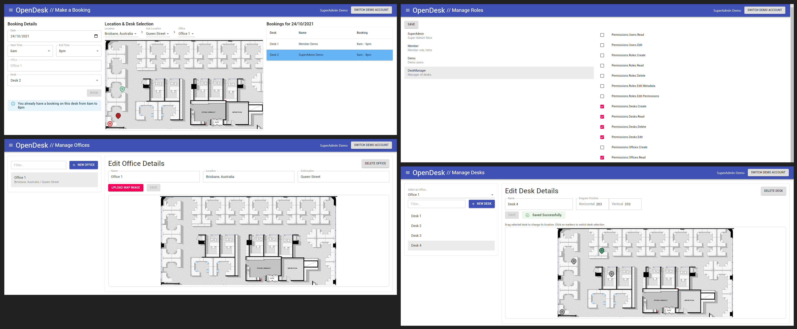

# OpenDesk

Demo: https://opendesk.iameric.net/

Hot Desking booking & office management tool built using ASP.NET 5, React + Material UI and PostgreSQL.

In a good enough state to deploy a demo - but still a lot of things to be improved (and a lot of `// TODO:`'s around the codebase! 😅)

When not operating in demo mode, the application allows user authentication via a Microsoft account.

# Deployment

The deployment process is still a work in progress (and I hope to get Github Actions set up soon), but at the moment I run `deploy-images.sh`, which (optionally) builds the images, and then saves them to the server by using a docker context. This is because I was running into issues with my server not having enough memory to build the React application, so instead I build the images locally and then load them onto the server by using `docker save` and `docker load`. Then I run the production `docker-compose` file on the remote `docker context` which runs those images and configures environment variables, etc.

I ran into a connection issue when using docker-compose over ssh, the resolution is described here: https://github.com/docker/compose/issues/7542#issuecomment-743138898.
